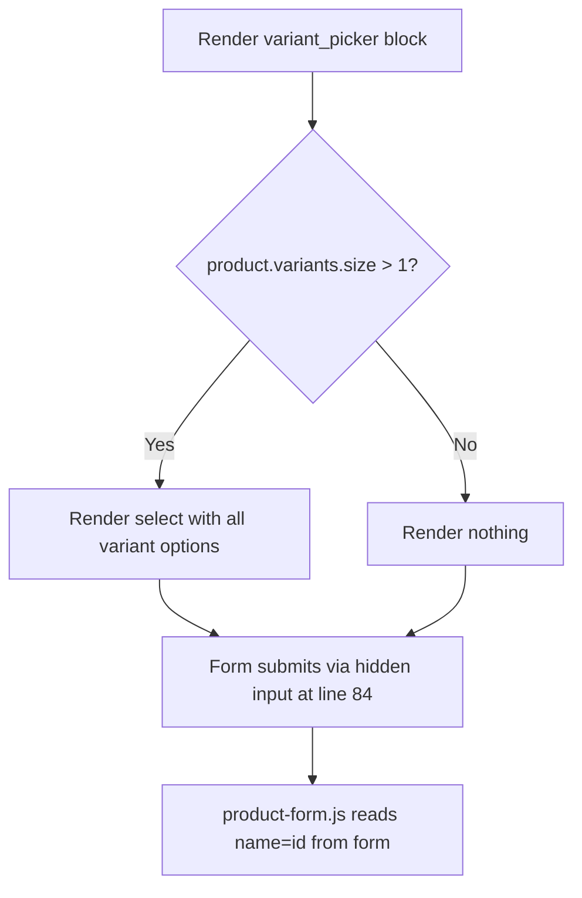

# Fix: Single-variant products show "Default Title - $X.XX" dropdown

**Slug:** `fix-single-variant-default-title-dropdown`
**Bug report:** `docs/bugs/single-variant-default-title-dropdown.md`
**Date:** 2026-05-18
**Author:** Architect

---

## 1. Root cause statement

The `variant_picker` block in `sections/product.liquid` (lines 63–72) renders a
`<select name="id">` unconditionally for every product, with no guard for
products that have only one variant.

```liquid

  <div class="product__variant-picker" {{ block.shopify_attributes }}>
    <select name="id">
      
        <option value="{{ variant.id }}" selected="selected">
          {{ variant.title }} - {{ variant.price | money }}
        </option>
      
    </select>
  </div>
```

For products with a single variant, Shopify stores that variant under the
internal placeholder name `Default Title`. The loop therefore emits one
`<option>` reading `Default Title - $X.XX`, which is surfaced to customers as a
non-functional dropdown.

The reason this has no impact on cart submission (and is purely cosmetic) is
that the `<select>` lives **outside** the `<form>` element. The actual
add-to-cart form is in the `buy_buttons` block (lines 80–98) and carries its
own hidden input that submits the variant ID:

```liquid
<input type="hidden" name="id" value="{{ product.selected_or_first_available_variant.id }}">
```

That hidden input (line 84) is the sole source of the variant ID for form
submission. The `<select>` in the `variant_picker` block is not wired into any
form (no `form="..."` attribute), so removing it for the single-variant case
does not break add-to-cart.

---

## 2. Proposed change

Wrap the contents of the `variant_picker` block with a guard that hides the
picker entirely when the product has only one variant. The block itself stays
in the schema so merchants can keep it placed in the theme editor; it simply
renders nothing on the storefront for single-variant products.

**Change in `sections/product.liquid`, replacing lines 63–72:**

```liquid

  
    <div class="product__variant-picker" {{ block.shopify_attributes }}>
      <select name="id">
        
          <option value="{{ variant.id }}" selected="selected">
            {{ variant.title }} - {{ variant.price | money }}
          </option>
        
      </select>
    </div>
  
```

### Design notes

- **The hidden input at line 84 is sufficient.** It already submits
  `product.selected_or_first_available_variant.id` on every form submission,
  regardless of whether a picker is rendered. No second hidden input is needed.
- **The `{{ block.shopify_attributes }}` wrapper is dropped for single-variant
  products.** This means the theme editor will not show a hover/select outline
  for that block on single-variant products. This is an acceptable tradeoff:
  the block has no UI to interact with in that case, and merchants can still
  see and configure the block in the block list. (See Open question 1 below
  if the team prefers an alternative.)
- **No CSS or JS changes.** `product-form.js` reads the variant ID via
  `this.form.querySelector('[name=id]')`, which resolves to the hidden input
  inside the form. The `<select>` was never inside the form, so removing it
  changes nothing for the JS.
- **Whitespace trim (``) is used** to avoid leaving an empty line
  in the rendered output for single-variant products.

---

## 3. Regression risk areas

Per the bug report, this section also gets written back into
`docs/bugs/single-variant-default-title-dropdown.md` under "Regression risk
areas" so QA has it on hand.

| Area | Risk | Verdict |
|---|---|---|
| Multi-variant products — variant picker render | The guard is `> 1`, so multi-variant products take the existing branch unchanged. | No risk. |
| Single-variant add-to-cart | The `<select>` is outside the `<form>`. The form has its own hidden `name="id"` at line 84. JS reads from `this.form.querySelector('[name=id]')` (`assets/product-form.js` line 139). | No risk. |
| Multi-variant add-to-cart | Same form/hidden-input path as above; the `<select>` was never participating in form submission. The picker still renders for multi-variant products, but it is decorative (not wired to the form) — that is a pre-existing limitation, not a regression of this fix. | No regression. (See Open question 2.) |
| `assets/product-form.js` | Reads variant ID via `this.form.querySelector('[name=id]')`. The hidden input at line 84 remains. | No risk. |
| `quantity_selector` block (lines 74–78) | Renders a `<input type="number" name="quantity">`. Has no dependency on the variant picker or variant state. | No risk. |
| `related-products` section (`sections/related-products.liquid`) | Renders `card-product` snippets for recommended products. Does not invoke the `variant_picker` block from `sections/product.liquid`. | No risk. |
| `card-product.liquid` snippet | Has its own self-contained variant-handling logic (checks `card_product.variants_count`, renders its own hidden `name="id"` input at line 369–376, or opens a quick-add modal for multi-variant products). Does not share code with the `variant_picker` block. | No risk. |
| `assets/product-info.js` | Grep match was only for the string `name="id"` in a different context; no behavior change. | No risk. |
| Theme editor preview | The `variant_picker` block remains in the schema (`limit: 1`) and still appears in the block list. For multi-variant products in the editor, the picker renders as before. For single-variant products in the editor, the picker renders nothing — same behavior as the storefront. | Acceptable. See Open question 1. |

---

## 4. Files to change

| File | Change |
|---|---|
| `sections/product.liquid` | Wrap lines 63–72 (the `variant_picker` block body) in `` / ``. No other edits. |

That is the only file that changes. No JS, CSS, schema, locale, or template
changes. No drive-by cleanups.

---

## 5. Data model and API changes

None. This is a render-time guard. The schema for the `variant_picker` block
(lines 251–273 of `sections/product.liquid`) is untouched, so the theme
editor's data model is unchanged. No locale keys are added or removed.

---

## 6. Proposed design (diagram)



The diagram makes the key point explicit: the form submission path
(`E -> F`) is the same regardless of whether the picker renders. The picker
is decorative; the hidden input is what carries the variant ID.

---

## 7. Risks, edge cases, and open questions

### Edge cases

- **Product with zero variants:** Impossible in Shopify; every product has at
  least one variant. `product.variants.size > 1` is therefore the correct
  guard.
- **Product becoming multi-variant later:** No issue — the guard re-evaluates
  on each render.
- **Theme editor with no product context:** The `variant_picker` block sits
  inside a product section; `product` will be a real product (likely the dev
  store's first product). Behaves like any other product page.

### Open questions

1. **Should single-variant products show a "stub" placeholder in the theme
   editor so merchants can still click the `variant_picker` block to select
   it?** The current proposal renders absolutely nothing for single-variant
   products, which makes the block invisible/unselectable on the editor
   canvas. The block is still listed in the block tree sidebar so it remains
   reachable. If the team would prefer an empty wrapper div (with
   `{{ block.shopify_attributes }}`) that is rendered but visually empty,
   that would be a one-line tweak. Recommendation: ship the simpler version
   first; revisit only if a merchant complains.

2. **Should the `variant_picker` block be wired into the `buy_buttons` form
   for multi-variant products?** Currently the `<select>` is outside the
   `<form>`, so changing it has no effect on add-to-cart for multi-variant
   products either. This is a pre-existing bug in the multi-variant flow,
   but it is **out of scope** for this fix (see section 8). File a separate
   bug if needed.

---

## 8. Out of scope

Explicitly NOT touched by this plan:

- The multi-variant picker wiring problem (Open question 2). The `<select>`
  not being connected to the form is a separate bug.
- Picker UX (the schema offers `picker_type` of `dropdown` or `button`, but
  the current code ignores that setting and always renders a `<select>`).
  Separate bug.
- Variant availability handling, sold-out states, price-per-variant updates.
- Anything in `card-product.liquid`, `product-info.js`, or `related-products`.
- Any CSS or styling changes.
- Any template (`templates/product.json`) or schema changes.
- Any locale changes.

---

## 9. Verification approach (for QA)

Run against the dev store (`https://theme-evolution-os2.myshopify.com`) and
also via local `shopify theme dev` preview. Capture before/after screenshots
at both mobile (375×667) and desktop (1440×900) viewports.

### Test cases

1. **Single-variant product — picker hidden.**
   - Navigate to a single-variant product (e.g.
     `https://theme-evolution-os2.myshopify.com/products/selling-plans-ski-wax`).
   - Expected: No `<select>` rendered below the title. No "Default Title -
     $X.XX" text anywhere on the page.
   - Verify via DOM inspector: `document.querySelector('.product__variant-picker')`
     returns `null`.

2. **Multi-variant product — picker still renders.**
   - Navigate to a multi-variant product (pick one from `docs/dev-fixtures.md`
     or any product with size/color variants in the dev store).
   - Expected: `<select>` is present, lists all variants, the
     selected-or-first-available variant is preselected.

3. **Add-to-cart works on single-variant product.**
   - On a single-variant product, click "Add to cart".
   - Expected: Item is added to cart, cart drawer or cart page reflects the
     correct variant ID.
   - Verify via Network tab: the request to `/cart/add` includes
     `id=<variant_id>` where `<variant_id>` matches
     `product.selected_or_first_available_variant.id`.

4. **Add-to-cart works on multi-variant product.**
   - On a multi-variant product, click "Add to cart" without changing the
     selector.
   - Expected: Item is added to cart with the
     `selected_or_first_available_variant`.
   - Note: Changing the `<select>` value does **not** currently affect the
     hidden input (pre-existing limitation, Open question 2). QA should not
     mark that as a fail for this bug.

5. **Theme editor preview.**
   - Open theme editor → product template → confirm the `variant_picker`
     block appears in the block list for both single-variant and
     multi-variant products.
   - Confirm the block is selectable in the block tree even for
     single-variant products (where it renders nothing).
   - Confirm the editor preview matches the storefront for both cases.

6. **Theme check passes.**
   - Run `shopify theme check` and confirm no new warnings or errors
     introduced by the change.

### Pass criteria

All six test cases above succeed. No console errors. No `theme check`
regressions.

---

## 10. Step-by-step implementation checklist for the Coder

1. **Read this plan in full** and the bug report at
   `docs/bugs/single-variant-default-title-dropdown.md`.
2. **Open `sections/product.liquid`.** Locate the `variant_picker` block
   (lines 63–72 at time of writing).
3. **Wrap the block body** in `` and
   ``. Use the exact code in section 2 of this plan.
4. **Make no other edits to the file.** Do not touch the schema, the
   stylesheet, or any other block.
5. **Run `shopify theme check`.** Confirm there are no new warnings or
   errors.
6. **Boot `shopify theme dev`** locally and visually verify:
   - A single-variant product no longer shows the "Default Title - $X.XX"
     dropdown.
   - A multi-variant product still shows the dropdown.
7. **Write impl notes** to `docs/plans/fix-single-variant-default-title-dropdown-impl-notes.md`:
   - Confirm the exact line-range edited.
   - Confirm `shopify theme check` was clean.
   - Note any deviation from the plan (there should be none).
8. **Commit** with a small, focused message:
   `fix(product): hide variant picker when product has only one variant`.
9. **Hand off to QA** by stopping. Do not deploy.

---

## 11. Regression risk areas to write back to the bug report

The bug report has a "Regression risk areas" section the Architect was asked
to fill in. The Coder/Architect should copy this summary into
`docs/bugs/single-variant-default-title-dropdown.md` under that heading:

> - **Multi-variant products:** picker must still render. Verified by guard
>   `product.variants.size > 1`.
> - **Single-variant add-to-cart:** unaffected. The form's hidden
>   `<input name="id">` at `sections/product.liquid` line 84 carries the
>   variant ID. The `<select>` was never inside the form.
> - **Multi-variant add-to-cart:** unchanged. Picker is decorative
>   (pre-existing — separate bug if pursued).
> - **`assets/product-form.js`:** reads variant ID via
>   `this.form.querySelector('[name=id]')`. Hidden input still present. No
>   change needed.
> - **`quantity_selector` block:** no dependency on variant state.
> - **`related-products` / `card-product.liquid`:** self-contained variant
>   handling. Not affected.
> - **Theme editor:** block remains in schema; selectable via block list.
>   Renders nothing on single-variant products (acceptable tradeoff).
