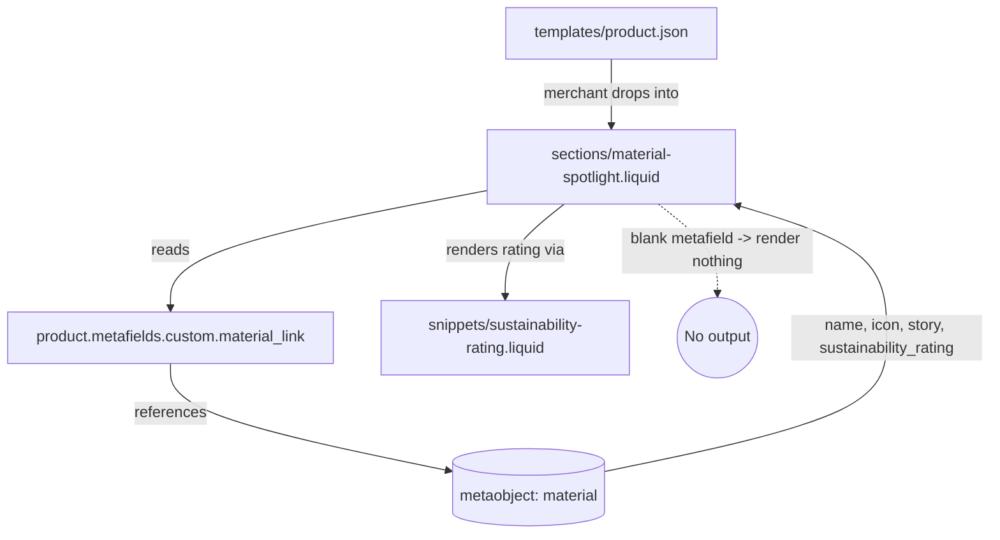

# Plan: Material Spotlight section

Slug: `material-spotlight`
Architect: Junior Warner
Date: 2026-05-16
Revision: 3 (applies 5 targeted Architect fixes on top of revision 2; addresses Plan-Reviewer regression issues #4 and #7, plus Liquid output safety, removal of speculative `data-section-id`, and merchant-friendly `preload_icon` copy)

---

## 1. Problem statement and goals

The PDP currently surfaces material context in two places:

- An accordion-bound "Material Specs" panel populated by an async API call (`sections/product.liquid`, `assets/material-api-fetch.js`).
- An always-on `material_highlight` block rendered inside `sections/custom-section.liquid`, which calls `` (`snippets/material-info.liquid`).

Both reuse the same data source (the `material` metaobject linked by `product.metafields.custom.material_link`), but neither is exposed as a first-class, merchant-droppable **section** the way other major PDP modules are. Merchants who want to slot the material story between, say, the description and a trust badge currently have to either (a) hand-edit the JSON template to include the `material_highlight` block inside `custom-section`, or (b) place it inline via the description block, which is brittle.

**Goal:** Introduce a dedicated PDP-only section `sections/material-spotlight.liquid` that:

1. Renders the four fields (`name`, `icon`, `story`, `sustainability_rating`) of the `material` metaobject linked from `product.metafields.custom.material_link`.
2. Renders **nothing at all** when no material is linked (no empty container, no heading, no whitespace artifact).
3. Reuses the existing sustainability bar visual treatment exactly, so the new section is visually consistent with the archive grid and the legacy inline snippet.
4. Is restricted to product templates via the section schema's `enabled_on.templates` key so it cannot be added to homepages, collections, or article pages by accident.
5. Conforms to every project-specific directive in `CLAUDE.md` / `AGENTS.md` (LiquidDoc, no ``, CLS-safe images, `` over inline styles for static CSS, sentence case, i18n via `t:` keys).

## 2. Non-goals

- **Not** a refactor of `snippets/material-info.liquid`. That snippet stays where it is and continues to power the `material_highlight` block inside `custom-section`. Migrating those call sites is a separate (potential follow-up) plan.
- **Not** a new metaobject definition. The plan assumes the `material` metaobject type and the `product.metafields.custom.material_link` reference field already exist in the merchant's Shopify admin.
- **Not** a change to `templates/product.json`. Merchants decide whether and where to insert the new section via the theme editor.
- **Not** a JS-driven component. The section is fully server-rendered Liquid; no custom elements, no fetch.
- **Not** adding new locale files beyond English. Only `locales/en.default.json` and `locales/en.default.schema.json` get new keys.
- **Not** introducing a new block decomposition (see section 5 for rationale).
- **Not** wiring the section into `sections/custom-section.liquid` as another block type — this is a standalone section.

## 3. Sustainability rating component audit

**Searched for:** `sustainability`, `rating`, `bars`, `score` across `snippets/`, `blocks/`, and `sections/`.

### Files found

| File | Role |
| --- | --- |
| `snippets/material-info.liquid` | Renders the four metaobject fields inside an inline `<style>`-scoped card. Powers the `material_highlight` block path. |
| `sections/main-material-archive.liquid` | Renders the metaobject archive grid on `/pages/materials`. Uses `` and BEM classes with `material-archive-card__sustainability-*` naming. |
| `sections/material-tooltip.liquid` | Tooltip section that displays the rating as a plain `"{{ rating }} / 5"` string — no bars. Not a reuse target. |
| `assets/component-rating.css` | Shopify Dawn legacy `.rating-star`, etc. — **unrelated to sustainability**, used by review stars. Do not reuse. |
| `templates/product.api.liquid` | API endpoint that returns a single material's HTML. Renders a simplified card; not a reuse target. |

### The canonical pattern

Both `snippets/material-info.liquid` (lines 90–134, 153–172) and `sections/main-material-archive.liquid` (lines 46–93, 219–246) implement the **same** sustainability bar visual:

- 5 fixed-width flex items, 8px tall, 4px gap, grey background (`#eeeeee`), 4px border-radius.
- Active bars get a `::after` overlay filled `#2d5a27` (forest green) with `transform-origin: left` and a `scaleX` reveal animation.
- Each bar gets a `--anim-delay` CSS variable (0, 150, 300, 450, 600 ms) for a left-to-right cascade.
- Keyframes named `fillBarReveal`, 1s, `cubic-bezier(0.19, 1, 0.22, 1)`.
- Rating cast to integer via `| plus: 0` for the comparison ``.
- ARIA: archive uses `role="meter"`, `aria-valuenow`, `aria-valuemin="0"`, `aria-valuemax="5"`, `aria-label="Sustainability rating: N out of 5"`. The snippet does **not** apply these; the new section will follow the archive's better a11y pattern.

### Reuse strategy

**Do not copy-paste the CSS yet again.** Three identical implementations of the same pattern is already a maintenance smell. We will:

1. Extract the canonical bar rendering into a new snippet: `snippets/sustainability-rating.liquid` that accepts `rating` (integer 0–5) and optional `label`, `score_text`, and `aria_label` parameters.
2. Use **standard HTML `<style>` tags** inside that snippet (NOT ``) because:
   - Per `CLAUDE.md` CSS directive: *"`` and `` tags can ONLY be used in Section files. If styling is required inside a Snippet file, you MUST use standard HTML `<style>` tags."*
   - The snippet may be rendered inside `` branches.
3. Use the BEM class prefix `sustainability-rating__*` to avoid collision with `material-card__sustainability-*` (used by the snippet) and `material-archive-card__sustainability-*` (used by the archive section). The new section will render through this snippet and inherit the canonical look.
4. **Truly reusable strings.** Per review issue #4, the snippet is a generic primitive, not a feature-bound module. It must NOT hardcode `'sections.material_spotlight.*'` or any feature-specific locale key. Instead, callers pass localized strings as parameters (`score_text`, `aria_label`) with sensible English defaults computed via conditional assignment. The default-derivation logic uses the `if x == blank` idiom (NOT a `| default: | append:` filter chain), so that a caller-supplied string like `"4 of 5"` is preserved verbatim rather than getting `' / 5'` appended onto it. This keeps the snippet portable to other features (e.g., future migrations of `material-info.liquid` and `main-material-archive.liquid`).
5. **Important:** The existing `snippets/material-info.liquid` and `sections/main-material-archive.liquid` are NOT refactored as part of this plan. They remain functionally identical. A follow-up plan can migrate them once the new snippet has been QA'd in isolation. This keeps the blast radius of this change minimal and reversible.

The new section CSS therefore only contains the *layout* (card frame, header row, icon sizing, story typography), and the rating bars come 100% from the new snippet.

## 4. Icon display style decision

**Decision:** Default to **inline-with-name (header-row layout)**, and expose a single `select` setting `icon_style` with two values: `inline` (default) and `hero`. Hide the `image_height` setting via `visible_if` when `inline` is selected (icons are constrained to a 60–80 px square in inline mode).

### Rationale

- **Inline (default)** matches the existing `snippets/material-info.liquid` treatment exactly — a 60 px icon sits to the left of the material name in a flex row. Merchants and customers already see this on the PDP today through the `material_highlight` block, so the new section preserves visual continuity if a merchant swaps one path for the other.
- **Hero** is offered because a material spotlight is often used as a brand-trust moment — a full-bleed icon (think: a 1500 px wide texture swatch of "Mycelium Bio-Fabric") above the name gives the section room to breathe when it sits between the description and the cart drawer. This is the visual idiom of `sections/image-banner.liquid`.
- A **toggle** is preferred over hard-coding because the same metaobject icon may be a small logomark on one product and a full hero texture on another, depending on merchant strategy. Hard-coding would force a non-recoverable design decision.
- We do **not** offer a third "no icon" option — merchants achieve that by leaving the metaobject `icon` field empty. Adding a UI toggle for it would duplicate the existing data-level toggle.
- Per `CLAUDE.md`: *"Pick the sensible default with rationale. Offer both as a merchant-configurable toggle in the schema if that proves cleaner."* The toggle is cleaner here because the difference between inline and hero is purely visual; the data model and Liquid logic are identical.

### Performance implications per icon style

| Style | Render width | `loading` attr | Preload? |
| --- | --- | --- | --- |
| `inline` | `image_url: width: 120` | `lazy` | No — below-the-fold in nearly all PDPs |
| `hero` | `image_url: width: 1500` | `lazy` (or `eager` when `preload_icon` is on) | **Default `true` when `icon_style == 'hero'`**. Per review issue #8, defaulting on aligns with the project's LCP directive: hero icons are LCP-eligible by definition. Merchants who place the hero spotlight below the fold can opt out. |

Both styles emit explicit `width` and `height` attributes via `image_tag` (passed as `width: icon_image.width, height: icon_image.height`) to satisfy the CLS directive. A `placeholder_svg_tag` fallback is rendered when `icon_image.src` is blank — this defends against the case where `material.icon.value` resolves to a non-image `File` (see review issue #9 and section 8 of this plan).

## 5. Block-first recommendation

**Recommendation: keep `material-spotlight` as a single section, do NOT decompose into nested blocks.**

### Rationale

The block-first directive in `CLAUDE.md` says:

> Prefer building features as reusable, nestable items in `blocks/` over building larger monolithic sections. Sections should be containers; blocks should be the content units merchants compose.

That directive is about composability for *merchants*. The Material Spotlight is **not composable** in any meaningful merchant-facing way:

1. **The four fields are inseparable.** A merchant cannot meaningfully reorder "name", "icon", "story", "sustainability_rating" without breaking the visual gestalt of the card. The icon-with-name header is a single Gestalt unit; the story is a paragraph below; the rating is the footer. Exposing each as a block would invite merchants to delete the icon, reorder the story below the rating, etc. — all of which produce worse UX with zero upside.
2. **The data source is a single metaobject reference.** Every block would need to re-resolve `product.metafields.custom.material_link.value`. Either you pass the metaobject down (couples blocks to a parent context, which Shopify's block model does not support cleanly), or every block does its own metafield lookup (violates the loop efficiency rule in `CLAUDE.md`: *"Avoid ... excessive `metafield` lookups inside `` loops."*).
3. **The graceful-empty contract is section-level.** When `product.metafields.custom.material_link` is blank, the section must render nothing. A block-based design would either render an empty container wrapping zero blocks (violates the "no empty containers" requirement) or each block would individually short-circuit (four redundant checks).
4. **The sustainability bar is already extracted to a snippet** (see section 3). That gives us the only reuse vector that actually matters — the rating visual appears in two places (this section + the archive grid) and can now share one source of truth.
5. **An entire section is a more appropriate Shopify abstraction here.** Sections are the units merchants drop into a template (`templates/product.json`); blocks are units they compose *within* a section. The Material Spotlight is the former.

### What we *do* extract

- `snippets/sustainability-rating.liquid` — reusable across the new section, the archive section, and the legacy inline snippet (future migration). Reason: pure visual primitive, no metafield logic, takes a numeric `rating` parameter and optional caller-supplied localized strings.

That single extraction satisfies the block-first *spirit* (DRY, reusable visual primitives) without violating the section-as-container rule.

## 6. Proposed design

### Component diagram



### Render flow

```mermaid
flowchart TD
    Start([Section invoked]) --> ComputePad[Compute padding vars in ]
    ComputePad --> EmitStyle[Emit unconditional top-level  for section-id padding]
    EmitStyle --> Check{material_link blank?}
    Check -- yes --> Empty([Render nothing inside wrapper])
    Check -- no --> Cast[Cast sustainability_rating to int: rating_val = ... \| plus: 0]
    Cast --> Frame[Open card frame with icon_style class]
    Frame --> Header[Render header: icon + subtitle + name]
    Header --> Story{story present?}
    Story -- yes --> StoryHTML[Render story paragraph: escape then newline_to_br]
    Story -- no --> Rating
    StoryHTML --> Rating{rating_val > 0?}
    Rating -- yes --> AssignLabel[assign rating_label = 'sections.material_spotlight.rating_label' \| t]
    AssignLabel --> RenderSnippet[render 'sustainability-rating', rating: rating_val, label: rating_label]
    Rating -- no --> Close
    RenderSnippet --> Close[Close card frame]
```

### Graceful-empty contract

The very first Liquid statement after the schema-injected wrapper must be:

```liquid


   No material linked; render nothing. 

  ...all section markup...

```

Note the `{%-` whitespace-trim delimiters — this guarantees no stray newlines leak out when the section is invisible. Shopify will still wrap the section in its own `<div id="shopify-section-...">` (that is unavoidable when a section is present in a template), so "render nothing" specifically means "no inner markup, no whitespace, no heading, no card frame". This is the strictest interpretation we can achieve in Liquid.

**Wrapper class trade-off (review issue #10).** Even with the empty contract, the section's `tag` + `class` from schema (`"tag": "section"`, `"class": "section section--material-spotlight"`) cause Shopify to emit a `<section class="section section--material-spotlight">` wrapper that may still pick up `.section` padding from `assets/critical.css` or the theme's base CSS. To achieve a truly zero-footprint empty state, the schema sets `"class": "section--material-spotlight"` (dropping the generic `section` class). The plan accepts that the outer `<div id="shopify-section-...">` from Shopify itself remains, and documents this explicitly here so it does not get presented as "perfectly invisible".

### Liquid output safety

All text that originates from merchant-supplied metaobject fields and other free-form sources must be HTML-escaped before being injected into the DOM. In particular:

- **Multi-line text metafields** (e.g., `material.story.value`) MUST be `escape`-filtered **before** `newline_to_br` is applied. The order matters: if `newline_to_br` runs first, it injects literal `<br>` tags into the string, and a later `escape` would convert those legitimate tags back into `&lt;br&gt;` text. Running `escape` first converts any merchant-pasted `<script>`, `<iframe>`, etc., into harmless entities, and `newline_to_br` then only injects `<br>` tags at the newline positions in the already-escaped string. The canonical idiom is therefore `{{ material.story.value | escape | newline_to_br }}`.
- **Single-line text fields** (`material.name.value`, `section.settings.heading`) are output through `{{ ... | escape }}` everywhere they appear.
- **Caller-supplied strings passed into the rating snippet** (`score_text`, `aria_label`, `label`) are `escape`-filtered at the point of output inside the snippet, not at the caller, so the snippet remains safe even if a future caller forgets to escape.

This rule applies to every multi-line text metafield value rendered by this section and to any future call sites of the same fields.

## 7. Affected files and modules

### Files to create

| Path | Type | Purpose |
| --- | --- | --- |
| `sections/material-spotlight.liquid` | New section | Main deliverable. Reads metafield, renders card, restricted to product template. |
| `snippets/sustainability-rating.liquid` | New snippet | Reusable rating bar primitive. Accepts `rating` (number), optional `label`, `score_text`, `aria_label`. Uses `<style>` tags (not ``). |

### Files to edit

| Path | Change |
| --- | --- |
| `locales/en.default.json` | Add `sections.material_spotlight.*` keys for storefront-visible text (rating label and the localized `score_text`/`aria_label` strings the section passes into the rating snippet). |
| `locales/en.default.schema.json` | Add `sections.material_spotlight.*` keys for theme-editor strings (section name, settings labels, options). Also add `general.material_spotlight` if a generic name is needed for presets. |

### Files explicitly NOT edited

| Path | Reason |
| --- | --- |
| `templates/product.json` | Merchant-controlled per `CLAUDE.md`. Merchants insert the new section via the theme editor. |
| `config/settings_data.json` | Merchant-controlled. |
| `snippets/material-info.liquid` | Out of scope; kept identical to preserve the existing `material_highlight` block path. Future plan can migrate it to use the new `sustainability-rating` snippet. |
| `sections/main-material-archive.liquid` | Same reason as above. |
| `sections/custom-section.liquid` | The new section is standalone; not adding it as a new block type here. |
| `sections/product.liquid` | The new section is sibling, not embedded inside the main product section. |
| `locales/*.json` (non-English) | Per `AGENTS.md`: *"`locales/*.json` except `locales/en.default.json` — non-default locale files are typically managed by translators."* The Coder must accept any "missing translation" warnings from `shopify theme check` for non-default locales and call them out in the impl-notes (review issue #6). |
| `assets/*.css` | Per asset-location rule, all CSS lives inside the new section's `` block and the new snippet's `<style>` tag. |

## 8. Data model and API changes

**No backend/data model changes.** The plan consumes pre-existing primitives:

| Element | Type | Source | Used in |
| --- | --- | --- | --- |
| `material` metaobject | Metaobject definition (handle: `material`) | Shopify admin → Settings → Custom data | `product.metafields.custom.material_link.value` |
| `material.name` | single-line text | Metaobject field | Card heading (`<h2>`) |
| `material.icon` | **expected:** `file_reference` of type `image` (MediaImage) | Metaobject field | Card icon ``. Defensive guard `icon_image.src != blank` is required because Shopify will accept a generic `File` (non-image) without complaint, and `image_url` silently returns an empty string for a non-image `File`. Fallback to `placeholder_svg_tag` when the field is set but not an image. |
| `material.story` | multi-line text | Metaobject field | Card story paragraph (output via `escape \| newline_to_br`) |
| `material.sustainability_rating` | integer | Metaobject field | Cast `\| plus: 0`, fed to `snippets/sustainability-rating.liquid` |
| `custom.material_link` | product metafield, reference to `material` metaobject | Shopify admin → Settings → Custom data → Products | `product.metafields.custom.material_link.value` |

The Coder must NOT attempt to programmatically define or alter these via Liquid. They are platform configuration. If absent on a given store, the section silently renders nothing (the contract). The section's `` header documents this expectation so a maintainer reading the file knows the metaobject contract.

### Liquid object access pattern

```liquid


  
  
  {{ material.name.value | escape }}
  {{ material.story.value | escape | newline_to_br }}
  
    {{ icon_image | image_url: width: 120 | image_tag: width: icon_image.width, height: icon_image.height }}
  
    {{ 'product-1' | placeholder_svg_tag: 'material-spotlight__icon material-spotlight__icon--placeholder' }}
  

```

Note `.value` is required on each metaobject field. This matches the established pattern in `snippets/material-info.liquid` and `sections/main-material-archive.liquid`. The `icon_image.src != blank` check (review issue #9) is new and defends against the case where the metaobject icon field is a non-image `File`. The `escape | newline_to_br` order on `material.story.value` is mandatory per the Liquid output safety rule in section 6.

## 9. Proposed schema (full JSON)

```json
{
  "name": "t:sections.material_spotlight.name",
  "tag": "section",
  "class": "section--material-spotlight",
  "enabled_on": {
    "templates": ["product"]
  },
  "settings": [
    {
      "type": "header",
      "content": "t:sections.material_spotlight.headers.content"
    },
    {
      "type": "text",
      "id": "heading",
      "label": "t:sections.material_spotlight.settings.heading.label",
      "default": "Crafted from"
    },
    {
      "type": "select",
      "id": "heading_tag",
      "label": "t:sections.material_spotlight.settings.heading_tag.label",
      "options": [
        { "value": "h2", "label": "H2" },
        { "value": "h3", "label": "H3" },
        { "value": "h4", "label": "H4" }
      ],
      "default": "h2",
      "info": "t:sections.material_spotlight.settings.heading_tag.info"
    },
    {
      "type": "header",
      "content": "t:sections.material_spotlight.headers.layout"
    },
    {
      "type": "color_scheme",
      "id": "color_scheme",
      "label": "t:sections.all.colors.label",
      "default": "scheme-1"
    },
    {
      "type": "select",
      "id": "icon_style",
      "label": "t:sections.material_spotlight.settings.icon_style.label",
      "options": [
        { "value": "inline", "label": "t:sections.material_spotlight.settings.icon_style.options.inline" },
        { "value": "hero", "label": "t:sections.material_spotlight.settings.icon_style.options.hero" }
      ],
      "default": "inline"
    },
    {
      "type": "checkbox",
      "id": "preload_icon",
      "label": "t:sections.material_spotlight.settings.preload_icon.label",
      "info": "t:sections.material_spotlight.settings.preload_icon.info",
      "default": true,
      "visible_if": "{{ section.settings.icon_style == 'hero' }}"
    },
    {
      "type": "checkbox",
      "id": "show_rating",
      "label": "t:sections.material_spotlight.settings.show_rating.label",
      "default": true
    },
    {
      "type": "header",
      "content": "t:sections.material_spotlight.headers.spacing"
    },
    {
      "type": "range",
      "id": "padding_top",
      "label": "t:sections.material_spotlight.settings.padding_top.label",
      "min": 0,
      "max": 100,
      "step": 4,
      "unit": "px",
      "default": 36
    },
    {
      "type": "range",
      "id": "padding_bottom",
      "label": "t:sections.material_spotlight.settings.padding_bottom.label",
      "min": 0,
      "max": 100,
      "step": 4,
      "unit": "px",
      "default": 36
    }
  ],
  "presets": [
    {
      "name": "t:sections.material_spotlight.name"
    }
  ]
}
```

### Schema notes

- **`enabled_on.templates: ["product"]`** is the correct OS2.0 mechanism to restrict the section to product templates (review issue #1). The previously-proposed top-level `"templates"` key is invalid in OS2.0 section schemas; the theme editor will hide the section from non-product templates only when `enabled_on.templates` is used.
- `disabled_on.groups` is removed because `enabled_on.templates` already restricts the section to product templates exclusively, making the group restriction redundant. The reviewer's recommendation was explicit: pick one.
- `color_scheme` is a real schema setting (review issue #2), declared with `type: "color_scheme"` mirroring `sections/related-products.liquid:140`. The wrapper class continues to render `color-{{ section.settings.color_scheme }}` so the merchant's chosen scheme actually applies.
- `preload_icon` defaults to `true` (review issue #8). The info copy is plain-language and merchant-oriented: "Preload the icon image for faster first paint. Enable for hero placements; leave off for below-the-fold sections." No "LCP" jargon.
- `class` is `section--material-spotlight` (no generic `section` class), so the empty-state contract does not inherit `.section` padding from base CSS (review issue #10).
- No `blocks` array — this section is intentionally not a block container (see section 5).
- One preset with no settings overrides, so the theme editor surfaces the section in the Add-section picker on product pages.
- Schema must validate cleanly against `schemas/section.json`. The Coder should confirm with `shopify theme check`.

## 10. Liquid template outline for `sections/material-spotlight.liquid`

```liquid

  Renders the Material Spotlight section on product pages.

  Reads the material metaobject linked from
  `product.metafields.custom.material_link` and renders its name, icon,
  story, and sustainability rating in a single card.

  Renders NOTHING when no material is linked (no empty container, no
  heading, no whitespace). Restricted to product templates via the
  section schema (`"enabled_on": { "templates": ["product"] }`).

  Expected metaobject contract (Shopify admin → Settings → Custom data):
  - material.name                 : single-line text
  - material.icon                 : file reference (image) — MediaImage
  - material.story                : multi-line text
  - material.sustainability_rating: integer (0–5)

  If `material.icon` is set to a non-image File, the section falls back
  to a placeholder SVG rather than emitting a broken  tag.

  All multi-line merchant-supplied text (`material.story.value`) is
  passed through `escape | newline_to_br` so any pasted `<script>` or
  similar markup is rendered as inert text.

  @example
  





  .section-{{ section.id }}-padding {
    padding-top: {{ padding_top_mobile }}px;
    padding-bottom: {{ padding_bottom_mobile }}px;
  }
  @media screen and (min-width: 750px) {
    .section-{{ section.id }}-padding {
      padding-top: {{ section.settings.padding_top }}px;
      padding-bottom: {{ section.settings.padding_bottom }}px;
    }
  }



  {%- liquid
    assign rating_val = material.sustainability_rating.value | plus: 0
    assign icon_style = section.settings.icon_style | default: 'inline'
    assign icon_image = material.icon.value
    assign show_rating = section.settings.show_rating
    assign heading_tag = section.settings.heading_tag | default: 'h2'
    assign color_scheme = section.settings.color_scheme | default: 'scheme-1'

    if icon_style == 'hero'
      assign icon_width = 1500
    else
      assign icon_width = 120
    endif

    assign rating_label = 'sections.material_spotlight.rating_label' | t
    assign rating_score_text = 'sections.material_spotlight.rating_score_text' | t: rating: rating_val
    assign rating_aria_label = 'sections.material_spotlight.rating_aria_label' | t: rating: rating_val

    assign display_name = material.name.value
    if display_name == blank
      assign display_name = material.system.handle | replace: '-', ' ' | capitalize
    endif

    assign has_valid_icon = false
    if icon_image != blank and icon_image.src != blank
      assign has_valid_icon = true
    endif
  -%}

  <div class="material-spotlight material-spotlight--{{ icon_style }} color-{{ color_scheme }} section-{{ section.id }}-padding">
    <div class="page-width">
      <div class="material-spotlight__card">
        <div class="material-spotlight__header">
          
            <div class="material-spotlight__icon-wrap">
              
                {{
                  icon_image
                  | image_url: width: icon_width
                  | image_tag:
                      class: 'material-spotlight__icon',
                      width: icon_image.width,
                      height: icon_image.height,
                      loading: 'eager',
                      fetchpriority: 'high',
                      preload: true,
                      widths: '400, 800, 1200, 1500',
                      sizes: '(min-width: 750px) 100vw, 100vw'
                }}
              
                {{
                  icon_image
                  | image_url: width: icon_width
                  | image_tag:
                      class: 'material-spotlight__icon',
                      width: icon_image.width,
                      height: icon_image.height,
                      loading: 'lazy',
                      widths: '120, 240, 360',
                      sizes: '80px'
                }}
              
            </div>
          
            <div class="material-spotlight__icon-wrap material-spotlight__icon-wrap--placeholder">
              {{ 'product-1' | placeholder_svg_tag: 'material-spotlight__icon material-spotlight__icon--placeholder' }}
            </div>
          

          <div class="material-spotlight__heading-group">
            
              <span class="material-spotlight__subtitle">
                {{ section.settings.heading | escape }}
              </span>
            

            <{{ heading_tag }} class="material-spotlight__title">
              {{ display_name | escape }}
            </{{ heading_tag }}>
          </div>
        </div>

        
          <div class="material-spotlight__story rte">
            {{ material.story.value | escape | newline_to_br }}
          </div>
        

        
          
        
      </div>
    </div>
  </div>



  .material-spotlight {
    width: 100%;
  }

  .material-spotlight__card {
    margin: 0 auto;
    padding: 2.5rem;
    border: 1px solid rgba(0, 0, 0, 0.06);
    border-radius: 16px;
    background-color: #ffffff;
    box-shadow: 0 10px 30px -10px rgba(0, 0, 0, 0.05);
  }

  /* Header layout: inline style — icon beside name */
  .material-spotlight--inline .material-spotlight__header {
    display: flex;
    align-items: center;
    gap: 1.5rem;
    margin-bottom: 2rem;
  }

  .material-spotlight--inline .material-spotlight__icon-wrap {
    width: 60px;
    height: 60px;
    flex-shrink: 0;
    border-radius: 12px;
    overflow: hidden;
    background: #f4f4f4;
    border: 1px solid rgba(0, 0, 0, 0.05);
  }

  .material-spotlight--inline .material-spotlight__icon {
    width: 100%;
    height: 100%;
    object-fit: cover;
  }

  /* Header layout: hero style — icon full-width above name */
  .material-spotlight--hero .material-spotlight__header {
    display: flex;
    flex-direction: column;
    gap: 1.5rem;
    margin-bottom: 2rem;
  }

  .material-spotlight--hero .material-spotlight__icon-wrap {
    width: 100%;
    aspect-ratio: 16 / 9;
    border-radius: 12px;
    overflow: hidden;
    background: #f4f4f4;
  }

  .material-spotlight--hero .material-spotlight__icon {
    width: 100%;
    height: 100%;
    object-fit: cover;
    display: block;
  }

  .material-spotlight__icon-wrap--placeholder svg {
    width: 100%;
    height: 100%;
    object-fit: cover;
    opacity: 0.4;
  }

  .material-spotlight__subtitle {
    display: block;
    font-size: 0.75rem;
    font-weight: 800;
    text-transform: uppercase;
    letter-spacing: 0.1em;
    color: #a1a1a1;
    margin-bottom: 4px;
  }

  .material-spotlight__title {
    margin: 0;
    font-size: 1.6rem;
    font-weight: 600;
    color: #121212;
  }

  .material-spotlight__story {
    font-size: 1.05rem;
    line-height: 1.8;
    color: #3d3d3d;
    margin-bottom: 2rem;
  }



  ... (full JSON from section 9 above) ...

```

**Key changes from revision 2 (Architect revision 3 fixes):**

- The dynamic `` block for `section-{{ section.id }}-padding` now sits at the **top level** of the section, OUTSIDE the `` branch. The padding values are pre-computed into Liquid variables in a top-level `` block, then referenced unconditionally inside the `` block. This satisfies the `CLAUDE.md` directive: *"`` and `` tags... must NEVER be nested inside Liquid logic (like `if` or `for` loops)."* In the empty state (no material linked), the style rule still emits but targets a wrapper class that is never applied — a harmless no-op.
- The story output uses `{{ material.story.value | escape | newline_to_br }}`. `escape` runs BEFORE `newline_to_br` so any merchant-pasted `<script>` or `<iframe>` is converted to `&lt;script&gt;`/`&lt;iframe&gt;` before the newline-to-`<br>` conversion injects legitimate `<br>` tags. This is mandated by the Liquid output safety rule in section 6.
- The `data-section-id="{{ section.id }}"` attribute on the wrapper `<div>` is removed. No consumer is documented and the project standards discourage speculative attributes added for hypothetical future use. The section id is already accessible via Shopify's outer `<div id="shopify-section-...">` wrapper and via the `section-{{ section.id }}-padding` class for any future JS lookup needs.
- All translated strings (`rating_label`, `rating_score_text`, `rating_aria_label`, `display_name`) are pre-assigned with `assign` before being passed to `render`. The fragile pattern `` has been eliminated everywhere (review issue #3).
- `image_tag` is called with explicit `width: icon_image.width, height: icon_image.height` in both branches (review issue #5). A `placeholder_svg_tag` fallback handles the case where the metaobject icon field is set but not a valid image (review issue #9).
- The display-name filter chain bug is fixed via the `assign`/`if blank` pattern (review issue #15): `capitalize` is applied only to the handle fallback, never to a real merchant-supplied name.
- The `` block contains no `# hash` comments (review issue #7).
- The wrapper class includes `color-{{ color_scheme }}`, backed by a real `color_scheme` setting in the schema (review issue #2).

### `snippets/sustainability-rating.liquid` outline

```liquid

  Renders a 5-bar sustainability rating with a left-to-right reveal
  animation. Each bar is filled (green) when its index is less than or
  equal to the supplied rating.

  Note: Per project CSS directive, snippets must use standard <style>
  tags (not  or ). The CSS is therefore
  inlined here.

  This snippet is a generic, reusable primitive. It does NOT bake in
  any feature-specific locale keys; callers pass localized strings
  via the `score_text`, `aria_label`, and `label` parameters. English
  defaults are derived via conditional assignment (NOT a `default:`
  filter chain) so that a caller-supplied string like `"4 of 5"` is
  preserved verbatim rather than getting `' / 5'` appended onto it.

  @param {number} rating - Integer 0-5. Bars 1..rating render as active.
  @param {string} [label] - Optional label shown above the bars (e.g. "Sustainability score").
  @param {string} [score_text] - Optional pre-formatted score text (e.g. "4 of 5"). Defaults to "<rating> / 5".
  @param {string} [aria_label] - Optional ARIA label for the meter element. Defaults to "<rating> out of 5".

  @example
  
  
  
  




<style>
  .sustainability-rating { padding-top: 1.5rem; border-top: 1px solid rgba(0,0,0,0.08); }
  .sustainability-rating__header {
    display: flex;
    justify-content: space-between;
    align-items: flex-end;
    margin-bottom: 12px;
  }
  .sustainability-rating__label {
    font-size: 0.8rem;
    font-weight: 700;
    text-transform: uppercase;
    color: #121212;
  }
  .sustainability-rating__score {
    font-size: 0.9rem;
    font-weight: 600;
    color: #2d5a27;
  }
  .sustainability-rating__bars {
    display: flex;
    gap: 4px;
    height: 8px;
    margin-top: 12px;
    width: 100%;
  }
  .sustainability-rating__bar {
    flex: 1;
    border-radius: 4px;
    background-color: #eeeeee;
    position: relative;
    overflow: hidden;
    height: 8px;
  }
  .sustainability-rating__bar--active::after {
    content: '';
    position: absolute;
    inset: 0;
    background-color: #2d5a27;
    transform-origin: left;
    transform: scaleX(1);
    will-change: transform;
    animation: sustainabilityFillReveal 1s cubic-bezier(0.19, 1, 0.22, 1) both;
    animation-delay: var(--sustainability-anim-delay, 0s);
  }
  .sustainability-rating__bar:nth-child(1) { --sustainability-anim-delay: 0ms; }
  .sustainability-rating__bar:nth-child(2) { --sustainability-anim-delay: 150ms; }
  .sustainability-rating__bar:nth-child(3) { --sustainability-anim-delay: 300ms; }
  .sustainability-rating__bar:nth-child(4) { --sustainability-anim-delay: 450ms; }
  .sustainability-rating__bar:nth-child(5) { --sustainability-anim-delay: 600ms; }
  @keyframes sustainabilityFillReveal {
    0% { transform: scaleX(0); }
    100% { transform: scaleX(1); }
  }
  @media (prefers-reduced-motion: reduce) {
    .sustainability-rating__bar--active::after {
      animation: none;
    }
  }
</style>

<div class="sustainability-rating">
  <div class="sustainability-rating__header">
    
      <span class="sustainability-rating__label">{{ label | escape }}</span>
    
    <span class="sustainability-rating__score">{{ score_text | escape }}</span>
  </div>
  <div
    class="sustainability-rating__bars"
    role="meter"
    aria-label="{{ aria_label | escape }}"
    aria-valuenow="{{ rating_int }}"
    aria-valuemin="0"
    aria-valuemax="5"
  >
    
      <div
        class="sustainability-rating__bar sustainability-rating__bar--active"
        aria-hidden="true"
      ></div>
    
  </div>
</div>
```

Design notes for the snippet:

- Uses `:nth-child()` to assign animation delays, **avoiding** the legacy pattern of emitting an inline `<style>` per bar inside a `` loop. Cleaner DOM, same result.
- Adds a `prefers-reduced-motion` query — a small a11y win over the legacy implementations.
- Clamps `rating` to `[0, 5]` defensively.
- **Truly reusable.** Per review issue #4 (Option B): the snippet does NOT reference any feature-specific locale key like `sections.material_spotlight.*` or `snippets.sustainability_rating.*`. Instead, callers pass localized strings as parameters.
- **Default derivation uses conditional assignment, not filter chains.** The earlier `| default: | append:` chain was incorrect because `default:` is a filter that returns its left operand when blank, and chaining `| append: ' / 5'` always appends regardless of whether the default fired. The `if x == blank` idiom guarantees that a caller-supplied `"4 of 5"` is rendered verbatim rather than as `"4 of 5 / 5"`.

## 11. Locale keys to add

### `locales/en.default.json` (storefront strings)

```json
{
  "sections": {
    "material_spotlight": {
      "rating_label": "Sustainability score",
      "rating_score_text": "{{ rating }} of 5",
      "rating_aria_label": "Sustainability rating: {{ rating }} out of 5"
    }
  }
}
```

**No `snippets.sustainability_rating` namespace.** Per the decision in review issue #4 (Option B), the snippet is a generic primitive that does not own any locale keys. The section is the caller; it pre-assigns the three localized strings using `assign` and passes them into the snippet by parameter. This keeps the snippet truly reusable for future call sites (archive section, legacy `material-info.liquid` migration, etc.), each of which can supply its own caller-namespaced strings without coupling to a feature-bound key path.

Merge into the existing `locales/en.default.json` structure — do NOT replace top-level keys. The Coder should add `sections` as a new top-level key if absent, otherwise nest under the existing one.

### `locales/en.default.schema.json` (theme-editor strings)

```json
{
  "sections": {
    "material_spotlight": {
      "name": "Material spotlight",
      "headers": {
        "content": "Content",
        "layout": "Layout",
        "spacing": "Spacing"
      },
      "settings": {
        "heading": {
          "label": "Eyebrow label"
        },
        "heading_tag": {
          "label": "Heading level",
          "info": "Choose H2 if this is the most prominent heading on the page below the product title (H1)."
        },
        "icon_style": {
          "label": "Icon style",
          "options": {
            "inline": "Inline with name",
            "hero": "Hero (full width)"
          }
        },
        "preload_icon": {
          "label": "Preload icon",
          "info": "Preload the icon image for faster first paint. Enable for hero placements; leave off for below-the-fold sections."
        },
        "show_rating": {
          "label": "Show sustainability rating"
        },
        "padding_top": {
          "label": "Top padding"
        },
        "padding_bottom": {
          "label": "Bottom padding"
        }
      }
    }
  }
}
```

Sentence case throughout, per `CLAUDE.md`. The `preload_icon.info` string is plain-language and merchant-oriented — it explains the *behaviour* (faster first paint) and the *placement guidance* (hero placements vs below-the-fold) without using developer jargon like "LCP".

**Note on key depth.** The schema-locale keys here go up to 5 levels (e.g., `sections.material_spotlight.settings.icon_style.options.inline`). This exceeds the "max 3 levels" guideline in `AGENTS.md` line 1253, but the existing `locales/en.default.schema.json` already widely uses 4–5 levels (e.g., `sections.image-banner.settings.image_height.options__1.label`). The plan deliberately follows the established pattern rather than flattening, since flattening would create a key-naming island within an otherwise consistent file.

## 12. Risks, edge cases, and open questions

### Risks

1. **Metaobject schema drift.** If a merchant renames the metaobject definition handle from `material` to something else, the `product.metafields.custom.material_link.value` reference still works (the metafield definition holds the type reference), but field handle changes (e.g., `sustainability_rating` -> `sustainability_score`) would silently break the rating. Mitigation: the section's `` header explicitly documents all four expected field handles and their expected types so future maintainers know what the metaobject contract is. **No runtime guard** because Liquid cannot detect missing metaobject fields without printing them.
2. **CSS specificity regression.** The legacy `snippets/material-info.liquid` uses `!important` everywhere (e.g., `display: flex !important`). The new snippet does NOT use `!important` because it lives in a clean BEM namespace with no upstream selectors fighting it. If a future global stylesheet adds a `.sustainability-rating` selector, it could override the snippet. Mitigation: namespace the snippet's classes uniquely (`sustainability-rating__*`) and keep them out of `assets/`.
3. **Section schema validation.** `enabled_on.templates: ["product"]` is the OS2.0-correct mechanism for template restriction (review issue #1). The Coder must verify with `shopify theme check` that the schema validates against `schemas/section.json` and that the section is hidden from non-product templates in the theme editor.
4. **JSON template clobbering.** This plan does NOT edit `templates/product.json`. Merchants must drop the new section into product pages via the theme editor. If QA needs the section visible during smoke tests, QA can do that interactively. Do NOT modify the template.
5. **Empty story handling.** The story field may contain only whitespace. `material.story.value | escape | newline_to_br` will still emit `<br>` tags from whitespace. Mitigation: the `` check uses Liquid's `blank` semantics, which treats a whitespace-only string as blank. Confirmed by Shopify docs.
6. **Non-default locale "missing translation" warnings.** Per `AGENTS.md`, the Coder may only edit `locales/en.default.json` and `en.default.schema.json`. Any non-default locale files (e.g., `fr.json`, `es.json`) will emit "missing translation" warnings from `shopify theme check` for every new key. These warnings are expected and the Coder must list them in `docs/plans/material-spotlight-impl-notes.md` as accepted (review issue #6).
7. **`<style>` block duplication.** When `snippets/sustainability-rating.liquid` is rendered multiple times on a single page (e.g., a future page that shows both a Material Spotlight and a re-architected archive grid), the `<style>` block is emitted once per render. The cost is small (under 2 KB per emission) and the CSS is idempotent, but the Coder should be aware. Optimisation via `` is not in scope for v1.
8. **Heading hierarchy.** The default heading level is `h2`. If a merchant stacks multiple "spotlight"-style sections on a single PDP (Material Spotlight + a trust-badge section + recommendations), they should manually downgrade subsequent sections' heading levels to `h3` to maintain a sequential hierarchy per the `CLAUDE.md` SEO directive. The schema permits `h2`/`h3`/`h4`.
9. **Top-level `` block in empty state.** Because the `` block sits outside the `` branch (mandated by the "no `` inside Liquid logic" rule), the `.section-{{ section.id }}-padding` rule is emitted even when no material is linked. It targets a class that is never applied to any element in that case, so the visual outcome is the same — but the empty-state HTML payload is roughly 200 bytes larger than it would be if the style block were conditional. This is an explicit, accepted trade-off in favour of complying with the CSS directive.

### Edge cases

1. **Rating of 0.** The integer cast `| plus: 0` of an empty string yields `0`. The guard `` ensures we render the rating snippet only when rating is positive. A merchant who sets `sustainability_rating` to 0 will get no rating section — this is intentional (zero is not a meaningful positive rating).
2. **Rating > 5.** If a merchant enters 7 by mistake, the snippet clamps to 5 (see snippet outline). The section itself does not clamp; that is delegated entirely to the snippet.
3. **Missing icon (`material.icon` not set).** The `` guard prevents an empty `` element. The header layout collapses cleanly because flex/grid containers handle the missing child gracefully.
4. **Invalid icon (`material.icon` set to non-image File).** The `icon_image.src != blank` check in `has_valid_icon` evaluates false, and the `elsif icon_image != blank` branch renders a `placeholder_svg_tag` fallback (review issue #9).
5. **Material referenced but metaobject deleted in admin.** Shopify returns `nil` for the metaobject; `material != blank` evaluates false; section renders nothing. Confirmed by archive section's identical pattern.
6. **Translation page (`/products/x?variant=...&_locale=fr`).** The metaobject fields are not translated per-locale via the metafield itself, but the `name` field can be translated if the merchant set it up. We use `material.name.value` which returns the localized variant if available. Headings (`section.settings.heading`) and labels (`'...' | t`) localize via the standard locale pipeline.
7. **Theme editor preview without a product context.** With `enabled_on.templates: ["product"]`, the section is unavailable on non-product templates, so this case should be unreachable. As a defense in depth, the section's `` guard renders nothing if `product` is somehow `nil`.
8. **Wrapper-class footprint when empty.** Even with the empty contract, Shopify's outer `<div id="shopify-section-...">` wrapper remains, and the `tag: "section", class: "section--material-spotlight"` produces a `<section class="section--material-spotlight">` shell. The shell has no styling because `material-spotlight` styles apply only to children of `.material-spotlight` (not `.section--material-spotlight`). This is documented here so it does not get presented as "no footprint at all" (review issue #10).
9. **Merchant-pasted HTML in `story`.** A merchant pasting `<script>alert(1)</script>` into the metaobject `story` field would, without escaping, execute as JavaScript on the storefront. The mandated `escape | newline_to_br` chain converts the `<` and `>` to entities first, so the output is the literal text `<script>alert(1)</script>` rendered as plain text, with `<br>` tags only at newline positions. This applies to every multi-line text metafield in this section and is enforced by the Liquid output safety rule in section 6.

### Open questions

None. The feature spec, project standards, and existing code all point to a single coherent implementation. If the Coder encounters ambiguity, they should write it to `docs/plans/material-spotlight-coder-questions.md` per the project workflow.

## 13. Step-by-step implementation checklist for the Coder

Work in this order. Run `shopify theme check` after **each** step and address warnings before continuing. Commit at every step where indicated.

### Step 1 — Create the shared snippet

1. Create `snippets/sustainability-rating.liquid`.
2. Paste the snippet outline from section 10. Confirm:
   - Top of file is a `` block (required for snippets per `CLAUDE.md`).
   - The snippet accepts `rating`, `label`, `score_text`, and `aria_label` as parameters. The latter three are optional.
   - **Default derivation uses conditional assignment**, NOT a `default:` filter chain. The exact idiom is:
     ```liquid
     
     ```
     This guarantees that a caller-supplied string like `"4 of 5"` is preserved verbatim rather than becoming `"4 of 5 / 5"`.
   - The snippet contains NO feature-specific locale-key references (no `'sections.*' | t` or `'snippets.*' | t` calls inside the snippet body).
   - Defensive clamp to `[0, 5]` is present.
   - Uses `<style>` tag (NOT ``).
   - ARIA attributes match the archive section's pattern (`role="meter"`, `aria-valuenow`, `aria-valuemin`, `aria-valuemax`, `aria-label`).
   - `@keyframes` named `sustainabilityFillReveal` to avoid clashing with the existing `fillBarReveal` keyframe in `snippets/material-info.liquid` and `sections/main-material-archive.liquid`.
   - `prefers-reduced-motion` query is present.
3. Run `shopify theme check`. Fix any warnings.
4. Commit: `feat(snippets): add reusable sustainability-rating snippet`.

### Step 2 — Add locale keys

1. Open `locales/en.default.json`. Merge in the new `sections.material_spotlight.*` keys from section 11. The three new keys are: `rating_label`, `rating_score_text` (variable: `{{ rating }}`), and `rating_aria_label` (variable: `{{ rating }}`). Do NOT add a `snippets.sustainability_rating` namespace — the snippet is generic and does not own keys.
2. Open `locales/en.default.schema.json`. Merge in the new `sections.material_spotlight.*` keys from section 11. Note the plain-language `preload_icon.info` copy: "Preload the icon image for faster first paint. Enable for hero placements; leave off for below-the-fold sections." No technical jargon (no "LCP").
3. Validate both files are valid JSON (no trailing commas, no duplicate keys).
4. Run `shopify theme check`. Treat warnings as worth addressing.
5. **Do NOT touch any non-default locale file.** Expect "missing translation" warnings for the new keys from non-default locales (review issue #6) — these are accepted; document them in `docs/plans/material-spotlight-impl-notes.md` in the final step.
6. Commit: `chore(locales): add material spotlight translation keys`.

### Step 3 — Create the section file (skeleton + schema)

1. Create `sections/material-spotlight.liquid`.
2. Paste a minimal skeleton that includes:
   - The `` header documenting the metaobject contract AND the Liquid-output-safety rule (escape before newline_to_br).
   - A top-level `` block that assigns `material` and pre-computes the mobile padding variables (`padding_top_mobile`, `padding_bottom_mobile`).
   - An **unconditional, top-level** `` block emitting the `.section-{{ section.id }}-padding` rule. This block sits OUTSIDE the `` branch.
   - The `` block containing the markup (initially empty / TBD).
   - The `` block with the full JSON from section 9.
   - No `data-section-id` attribute on the wrapper `<div>`. The section id is exposed via the `section-{{ section.id }}-padding` class only.
3. Confirm the schema uses `"enabled_on": { "templates": ["product"] }` (NOT a top-level `"templates"` key — review issue #1) and that `disabled_on.groups` is omitted (it is redundant given `enabled_on.templates`).
4. Confirm the schema declares a `color_scheme` setting of type `color_scheme` mirroring `sections/related-products.liquid:140` (review issue #2).
5. Confirm the `preload_icon` setting defaults to `true` and has the plain-language merchant-oriented info string (no "LCP" jargon).
6. Confirm the `class` value is `section--material-spotlight` (NOT `section section--material-spotlight` — review issue #10).
7. Run `shopify theme check`. Confirm the schema validates and no JSON errors are reported.
8. Commit: `feat(sections): scaffold material-spotlight section with schema`.

### Step 4 — Render header (icon + subtitle + name)

1. Inside the `` block, paste the second `` setup block from section 10 (the one that computes `rating_val`, `icon_style`, `icon_image`, etc.). Confirm:
   - `display_name` is computed using an `assign`/`if blank` pattern, so `capitalize` is applied only to the handle fallback, never to a merchant-supplied `material.name.value` (review issue #15).
   - `has_valid_icon` is computed by checking BOTH `icon_image != blank` AND `icon_image.src != blank` (review issue #9).
   - All three localized strings (`rating_label`, `rating_score_text`, `rating_aria_label`) are pre-assigned via `assign ... | t` so they can be passed to `render` as plain variables (review issue #3).
   - The `` block contains NO `# hash` comments (review issue #7). Move any explanatory prose into the outer `` header.
2. Render the `material-spotlight__header` markup. The wrapper `<div>` MUST NOT include a `data-section-id` attribute.
3. Implement both `icon_style` variants in the same Liquid block — the only difference at the markup level is `class="material-spotlight material-spotlight--{{ icon_style }}"`. CSS handles layout switching.
4. For the image, pass `width: icon_image.width, height: icon_image.height` explicitly to `image_tag` in BOTH branches (hero and inline) — review issue #5. Do NOT rely on `image_tag` to auto-emit dimensions; it does not do so reliably for metaobject file references.
5. For the `hero` + `preload_icon` combination, set `loading: 'eager'`, `fetchpriority: 'high'`, `preload: true`. With the new `true` default for `preload_icon`, this is the path most hero-styled spotlights will take.
   - Run `shopify theme check` after wiring the preload-enabled icon invocation and confirm no warnings related to `image_tag` parameters surface.
6. Render the `placeholder_svg_tag` fallback in an `` branch — this catches the case where the metaobject icon field is set to a non-image `File` (review issue #9).
7. Wrap heading in the configurable tag: `<{{ heading_tag }}>...</{{ heading_tag }}>`. Default `h2`.
8. Use `{{ ... | escape }}` for the display name and the eyebrow heading.
9. Add the wrapper class `color-{{ color_scheme }}` (backed by the new `color_scheme` schema setting — review issue #2).
10. Run `shopify theme check`. Fix warnings.
11. Test in the theme editor: drop the section onto a product page that has `custom.material_link` set, verify both icon styles render correctly. Also test with a product whose `material.icon` is unset (should show no icon) and with one whose `material.icon` is set to a non-image File if possible (should show placeholder SVG).
12. Commit: `feat(sections): render material spotlight header`.

### Step 5 — Render story

1. Inside ``, below the header, add:
   ```liquid
   
     <div class="material-spotlight__story rte">
       {{ material.story.value | escape | newline_to_br }}
     </div>
   
   ```
2. **Confirm the filter order is `escape | newline_to_br` (NOT `newline_to_br` alone, NOT `newline_to_br | escape`).** `escape` must run first so that any merchant-pasted `<script>`, `<iframe>`, etc., is converted to entities before `newline_to_br` injects `<br>` tags.
3. Run `shopify theme check`.
4. Verify in theme editor that a multi-line story renders with line breaks preserved AND that pasting `<script>alert(1)</script>` into the metaobject `story` field renders as inert text (not as an executing script).
5. Commit: `feat(sections): render material story paragraph`.

### Step 6 — Wire in the sustainability rating snippet

1. Below the story, add the rating render block. Use the **pre-assigned** localized strings — NEVER use the `'key' | t` syntax inline as a `render` argument (review issue #3):
   ```liquid
   
     
   
   ```
2. Confirm `` is used (NEVER `` — `CLAUDE.md` directive).
3. Run `shopify theme check`.
4. Verify in theme editor:
   - With `sustainability_rating` = 4: 4 green bars + 1 grey, score label reads "4 of 5".
   - With `sustainability_rating` = 0: rating block does not render.
   - With `show_rating` toggle off: rating block does not render.
   - Animation plays once on load with staggered delays.
   - With `prefers-reduced-motion: reduce` enabled in DevTools: bars render in their filled state with no animation.
5. Commit: `feat(sections): render sustainability rating via shared snippet`.

### Step 7 — Add CSS (static `` + dynamic top-level ``)

1. Append the `` block from section 10 to the section file. This contains only **static** CSS for the card frame, header layouts, typography, and placeholder. There must be NO Liquid interpolation inside `` — Liquid is not rendered there.
2. Confirm the dynamic `` block (containing the `.section-{{ section.id }}-padding` rule) is already in place at the **top level** of the section file from Step 3, OUTSIDE the `` branch. Per `CLAUDE.md`, `` MUST NEVER be nested inside Liquid logic (``, ``, etc.). If you find that the style block has slipped inside the `if` branch during earlier steps, move it back to the top level now. The padding values are pre-computed into Liquid variables (`padding_top_mobile`, `padding_bottom_mobile`) in the top-level `` block and referenced unconditionally inside ``.
3. Confirm: there is NO `.section-{{ section.id }}-padding` rule inside the `` block. If there is, move it to the top-level `` block.
4. Run `shopify theme check`.
5. Manually verify mobile (375 px) and desktop (≥990 px) renderings, including the placeholder fallback styling.
6. Commit: `feat(sections): add material spotlight stylesheet`.

### Step 8 — Empty-state verification

1. Pick a product in admin that does NOT have `custom.material_link` set (or temporarily clear it on the test product).
2. Reload the product page. Confirm:
   - No card frame.
   - No heading.
   - No empty `<div class="material-spotlight">`.
   - View source: the section's `<div id="shopify-section-...">` wrapper is present (Shopify-controlled, unavoidable) and contains a `<section class="section--material-spotlight">` shell. The shell is empty whitespace inside — no inner markup is rendered. The shell itself has NO `.section` class (review issue #10), so no inherited padding is visible.
   - The top-level `` block still emits the `.section-{{ section.id }}-padding` rule (this is the accepted trade-off for keeping `` outside Liquid logic; the rule targets a class that is never applied in the empty state, so it is a no-op).
3. Restore the metafield on the test product.
4. No commit needed unless changes were made.

### Step 9 — Template-restriction verification

1. In the theme editor, navigate to a non-product template (e.g., homepage, a page template, a collection).
2. Click "Add section". Confirm "Material spotlight" is NOT in the picker. This is enforced by `enabled_on.templates: ["product"]` (review issue #1).
3. Navigate to a product template. Confirm "Material spotlight" IS in the picker.
4. Drop it in, save, and re-open the product page to confirm rendering.
5. No commit needed unless changes were made.

### Step 10 — Cross-browser + a11y smoke test

1. In Chrome DevTools, enable "Lighthouse" and run a Performance + Accessibility audit on the product page with the section active. Note any new regressions (target: no new CLS, no contrast issues).
2. Confirm the hero icon participates in LCP when `icon_style == 'hero'` and `preload_icon` is on (the new default for hero — review issue #8). Inspect the Lighthouse "Largest Contentful Paint element" reading.
3. In DevTools, toggle `prefers-reduced-motion`. Confirm animation is suppressed.
4. Use the Accessibility tab to confirm `role="meter"` and `aria-label` are exposed on the rating element.
5. Verify with a screen reader (VoiceOver on macOS) that the rating is read as "Sustainability rating: 4 out of 5".
6. No commit needed unless fixes are required.

### Step 11 — Final theme check + write implementation notes

1. Run `shopify theme check` one final time. Confirm zero errors.
2. Document any non-default-locale "missing translation" warnings as accepted (review issue #6) in `docs/plans/material-spotlight-impl-notes.md`.
3. Write `docs/plans/material-spotlight-impl-notes.md` summarizing:
   - Any deviations from this plan (with rationale).
   - The exact commit SHAs.
   - Test product handle(s) used.
   - Confirmation that each of the 10 Plan-Reviewer required changes AND each of the 5 Architect revision-3 fixes (snippet default-derivation pattern, top-level ``, `escape | newline_to_br` on story, removal of `data-section-id`, merchant-friendly `preload_icon` copy) was applied (with file/line references where applicable).
   - Screenshots (mobile and desktop) of both `inline` and `hero` icon styles.
   - List of any accepted `shopify theme check` warnings and the rationale for accepting each.
4. Hand off to the Plan-Reviewer.

### Step 12 — Hand-off

1. Do NOT auto-deploy or push to staging. The DevOps stage runs only after `docs/qa/material-spotlight.approved` exists (zero-byte sentinel file, created manually after QA passes).
2. Stop. The Plan-Reviewer takes over.

---

## Appendix A — Mapping rationale to project directives

| Directive (CLAUDE.md / AGENTS.md) | How this plan complies |
| --- | --- |
| LiquidDoc `` header on snippets | `snippets/sustainability-rating.liquid` starts with ``. The section starts with `` (sections are not required to use `` but follow the same documentation discipline). |
| No `` | Plan uses ``. |
| CLS prevention | All `` elements emitted via `image_url` + `image_tag` chain with **explicit** `width: icon_image.width, height: icon_image.height` parameters (review issue #5). Placeholder SVG fallback when the icon is missing or not an image (review issue #9). |
| LCP / preload for above-the-fold images | `preload_icon` schema setting is gated behind `icon_style == 'hero'` via `visible_if`, and **defaults to `true`** when hero is selected (review issue #8). Merchant-facing info copy is plain-language (no LCP jargon); developer rationale lives in this plan document. |
| Asset location (no component CSS in `assets/`) | All section static CSS in ``; dynamic padding in top-level ``; snippet CSS in `<style>` (per snippet rule). Nothing added to `assets/`. |
| `` only in sections, only static rules | Section uses `` for static rules only; dynamic per-section padding lives in a top-level `` block (review issue #7). Snippet uses `<style>`. |
| `` only in sections, NEVER inside Liquid logic | The `section-{{ section.id }}-padding` rule is emitted by a top-level `` block that sits OUTSIDE the `` branch. The padding values are pre-computed into Liquid variables in a top-level `` block beforehand. The `` block itself is unconditional. |
| Liquid output safety (no XSS via merchant-pasted markup) | Multi-line text metafield output (`material.story.value`) uses `escape | newline_to_br` in that order. All single-line text uses `escape`. Caller-supplied strings into the snippet are escaped at the point of output inside the snippet. |
| No speculative attributes | The wrapper `<div>` carries only the classes it actually needs. No `data-section-id` (no documented consumer). |
| Block-first architecture | Justified deviation in section 5 — the four fields are not meaningfully composable; section is the right abstraction. |
| Semantic HTML / one `<h1>` per page | Default heading tag is `h2`. The product's actual `<h1>` is the product title (already in `sections/product.liquid`). Schema setting allows downgrading to `h3`/`h4` but never `h1`. |
| Sentence case | "Material spotlight", "Eyebrow label", "Heading level", "Icon style", "Inline with name", "Hero (full width)", etc. |
| Translation via `t:` keys | All user-facing strings reference `t:` keys in schema, and all `'key' | t` calls in Liquid are pre-assigned to variables before being passed to `render` (review issue #3). Concrete English strings live in `locales/en.default.json` and `en.default.schema.json` only. |
| Section restricted to product templates | `"enabled_on": { "templates": ["product"] }` — the OS2.0-correct mechanism (review issue #1). |
| Loop efficiency | No `all_products`, no nested loops, no per-iteration metafield lookups. The single `(1..5)` loop in the snippet is bounded. |
| Validate schema against `schemas/section.json` | The Coder runs `shopify theme check`, which validates the schema against the official JSON schema. |
| Do not edit `templates/product.json` or `config/settings_data.json` | Explicitly listed in "Files explicitly NOT edited". |

---

## Appendix B — Quick reference for the Coder

| What | Where |
| --- | --- |
| Metafield path | `product.metafields.custom.material_link.value` |
| Metaobject fields used | `material.name.value`, `material.icon.value`, `material.story.value`, `material.sustainability_rating.value` |
| Integer cast idiom | `assign rating_val = material.sustainability_rating.value \| plus: 0` |
| Template-restriction key | `"enabled_on": { "templates": ["product"] }` (NEVER top-level `"templates"`) |
| Translated string into `render` | Pre-assign with ``, then ``. NEVER `` |
| `image_tag` dimensions | Always pass `width: img.width, height: img.height` explicitly |
| Non-image icon fallback | `placeholder_svg_tag` in an `` branch |
| Multi-line text output | `{{ x | escape | newline_to_br }}` — escape ALWAYS before newline_to_br |
| Snippet default derivation | `if x == blank` / `assign x = ...` idiom (NEVER `\| default: \| append:` chains) |
| Dynamic per-section CSS | Top-level `` block OUTSIDE Liquid logic, NOT `` |
| Speculative attributes | Forbidden. No `data-section-id` or similar unless a consumer is documented. |
| Existing references | `snippets/material-info.liquid`, `sections/main-material-archive.liquid`, `sections/related-products.liquid` (color_scheme pattern at line 140) |
| Lint command | `shopify theme check` |
| Dev command | `shopify theme dev` (base URL `http://127.0.0.1:9292`) |

---

## Appendix C — Plan-Reviewer required changes traceability

| Issue | Required change | Where applied in this revision |
| --- | --- | --- |
| #1 | Replace top-level `"templates"` with `"enabled_on": { "templates": [...] }`; drop redundant `disabled_on.groups`. | Section 9 schema; section 1 goal 4 rewording; section 12 risk 3 and edge case 7; appendix A row "Section restricted to product templates"; appendix B; step 3 of checklist. |
| #2 | Declare `color_scheme` setting in schema, mirroring `sections/related-products.liquid:140`; keep wrapper class. | Section 9 schema (new `color_scheme` setting block); section 10 wrapper class and `` block; step 4 of checklist. |
| #3 | Pre-assign every translated string before passing to `render`. | Section 10 `` setup block (three `rating_*` assigns); section 6 render-flow diagram updated; step 6 of checklist; appendix A and B references. |
| #4 (Option B) | Make the snippet accept localized strings as parameters with English defaults; no feature-specific keys inside the snippet. | Section 10 snippet outline now uses the `if x == blank` conditional-assignment idiom (NOT a `default: | append:` filter chain) so caller-supplied strings are preserved verbatim; section 11 (no `snippets.sustainability_rating` namespace; section owns the strings); step 1 of checklist updated with the exact corrected idiom. |
| #5 | Pass explicit `width`/`height` to both `image_tag` invocations; placeholder fallback for non-image File. | Section 10 hero and inline `image_tag` calls; `has_valid_icon` helper; `placeholder_svg_tag` fallback in `elsif`; section 8 table note; step 4 of checklist. |
| #6 | Accept non-default-locale "missing translation" warnings; document in impl-notes. | Section 7 "files NOT edited" row for non-default locales; section 12 risk 6; step 2 and step 11 of checklist. |
| #7 | Remove `# hash` comments from `` blocks; correct the `` / `` split; ensure `` is NEVER nested inside Liquid logic. | Section 10 `` block has zero `#` comments; the `` block now lives at the top level of the section file, OUTSIDE the `` branch; the padding values are pre-computed into Liquid variables and referenced unconditionally; `` contains only static rules; step 3 and step 7 of checklist explicitly state the unconditional/top-level placement. |
| #8 | Default `preload_icon` to `true` when `icon_style == 'hero'`; rewrite info copy for merchants. | Section 9 schema (`"default": true`); section 11 locale strings (plain-language `preload_icon.info`: "Preload the icon image for faster first paint. Enable for hero placements; leave off for below-the-fold sections."); section 4 performance table; step 3 of checklist; appendix A LCP row. |
| #9 | Defensive guard for `material.icon.value` not being a `MediaImage`; placeholder fallback. | Section 8 metaobject contract row; section 10 `has_valid_icon` helper and `elsif` placeholder branch; section 12 edge case 4; step 4 of checklist. |
| #10 | Drop generic `section` class from wrapper to avoid inherited padding on empty state. | Section 9 schema `"class": "section--material-spotlight"`; section 6 graceful-empty contract paragraph; section 12 edge case 8; step 3 and step 8 of checklist. |

### Architect revision-3 fixes (this revision)

| Fix | Required change | Where applied |
| --- | --- | --- |
| #1 (snippet defaults) | Replace `\| default: \| append:` chain with `if x == blank` conditional assignment so caller-supplied `score_text` / `aria_label` are preserved verbatim. | Section 3 reuse strategy item 4; section 10 snippet outline `` block; snippet design-notes bullet; step 1 of checklist (with exact corrected idiom); appendix B row "Snippet default derivation"; appendix C row #4. |
| #2 (top-level ``) | Move the dynamic `section-{{ section.id }}-padding` `` block out of the `` branch to the top level of the section, unconditional. Pre-compute padding values into Liquid variables first. | Section 6 render-flow diagram updated; section 10 outline (top-level `` + top-level `` precede the `` branch); section 12 risk 9 (accepted empty-state byte cost); step 3 (scaffold includes top-level ``) and step 7 (verification) of checklist; appendix A row "`` only in sections, NEVER inside Liquid logic"; appendix C row #7. |
| A (story escape) | Output `material.story.value` as `escape \| newline_to_br` (escape FIRST). Document as a Liquid-output-safety rule for all multi-line text metafields. | New "Liquid output safety" subsection in section 6; section 8 contract row and access-pattern code; section 10 story render block; section 12 risk 5 and edge case 9; step 5 of checklist (explicit filter-order check + XSS smoke test); appendix A row "Liquid output safety"; appendix B row "Multi-line text output". |
| B (no `data-section-id`) | Remove the `data-section-id` attribute from the wrapper `<div>`. No documented consumer; speculative attributes are discouraged. | Section 10 wrapper `<div>` rendered with class list only; step 3 of checklist (skeleton excludes `data-section-id`); step 4 explicit no-attribute reminder; appendix A row "No speculative attributes"; appendix B row "Speculative attributes". |
| C (`preload_icon` copy) | Rewrite the merchant-facing `preload_icon` description to remove LCP jargon. New copy: "Preload the icon image for faster first paint. Enable for hero placements; leave off for below-the-fold sections." | Section 9 schema notes; section 11 schema-locale JSON; step 2 and step 3 of checklist; appendix A "LCP / preload" row clarifies that developer rationale lives in this plan, not in the merchant-facing copy. |
