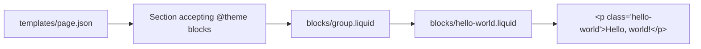

# Plan: Say Hello World

## 1. Problem statement and goals

Add a minimal, theme-editor-friendly "Hello World" surface to the Shopify Skeleton theme so a developer or merchant can verify the theme renders correctly and confirm the local dev workflow (`shopify theme dev`) works end-to-end.

Goals:
- Provide a visible "Hello, world!" string on a storefront page without requiring code edits to add it once installed.
- Follow existing Skeleton conventions (block-based architecture, ``, ``, locale strings).
- Keep the change small, idiomatic, and easy to remove.

## 2. Non-goals

- No JavaScript interactivity.
- No new sections, layouts, templates, or routes.
- No app blocks, metaobjects, or storefront APIs.
- No theme-wide styling changes; styles are scoped to the new block.
- No translations beyond English (the existing skeleton ships only `en.default.json`-style locale conventions; we add to the same locale namespace if present, otherwise leave the string inline as the default).

## 3. Proposed design

Introduce a single new theme block, `blocks/hello-world.liquid`, that renders a configurable greeting. Merchants drop it into any section that accepts `@theme` blocks (for example, the existing `group` block on a page template).

Rendering contract:
- Outputs a single `
` element.
- Greeting text is a `text` setting, defaulting to `"Hello, world!"`.
- Optional alignment setting reuses the `text_alignment` schema type already used in `blocks/text.liquid` for consistency.
- Styles scoped via a CSS class plus a `--text-align` CSS variable, matching the pattern in `blocks/text.liquid`.

## 4. Affected files and modules

Files to create:
- `blocks/hello-world.liquid` — new theme block.

Files potentially modified (optional, only if the developer wants the block to appear by default on a starter page):
- `templates/page.json` — add a preset instance of the new block inside an existing section/group. This is optional and called out as a tradeoff below.

No changes to `assets/`, `config/`, `layout/`, `sections/`, `snippets/`, or `.theme-check.yml`.

## 5. Data model and API changes

None. No metafields, metaobjects, settings_schema, or external APIs are introduced.

Block schema (new, additive only):

| Setting id  | Type             | Default          | Purpose                       |
|-------------|------------------|------------------|-------------------------------|
| `greeting`  | `text`           | `Hello, world!`  | The text rendered in the `
`|
| `alignment` | `text_alignment` | `left`           | Controls `text-align` via CSS var |

Schema also exposes a single preset so the block shows up in the theme editor's "Add block" picker.

## 6. Risks, edge cases, and open questions

Risks / edge cases:
- Theme-check may flag missing translation keys if the skeleton enforces `t:` lookups for `name` / `label`. Mitigation: use plain string literals for `name` and `label` to avoid coupling to a locales file we may not have. If a `locales/en.default.schema.json` exists, prefer adding keys there to match `blocks/text.liquid` conventions.
- The block must be placed inside a section that accepts `@theme` blocks (e.g., a `group` block) to render. Otherwise, merchants will not see it. Documented in the block's `` example.
- HTML escaping: greeting is rendered with `{{ block.settings.greeting }}`. Since `text` settings are merchant-controlled plain text, Liquid's default escaping is sufficient. Do not use `| raw`.

Open questions (none blocking; default decisions noted):
- Should the block be auto-added to `templates/page.json` so it is visible immediately on `/pages/*`? Default: no, to keep the change non-invasive. Coder may add it behind a clear comment if desired.
- Does the project have a `locales/` directory with a schema-locale file mirroring the `t:` keys used in `blocks/text.liquid` (e.g., `t:general.text`)? If yes, mirror that pattern; if not, inline strings.

## 7. Step-by-step implementation checklist for the Coder

1. Create `blocks/hello-world.liquid` with the following structure (mirroring `blocks/text.liquid`):
   - `` block with description and an `@example` showing ``.
   - Markup: `
{{ block.settings.greeting }}
`.
   - `` with a single rule: `.hello-world { text-align: var(--text-align); }`.
   - `` containing:
     - `"name": "Hello world"` (or `"t:general.hello_world"` if a matching locale key is added).
     - `settings`: a `text` setting `greeting` defaulting to `"Hello, world!"`, and a `text_alignment` setting `alignment` defaulting to `"left"`.
     - `presets`: one entry named `"Hello world"`.
2. Verify the block lints clean against `theme-check:recommended` (no missing translations if you used `t:` keys, no parser errors).
3. (Optional) Open `templates/page.json` and add the new block as a child of an existing `group` block so it renders out of the box; only do this if the user wants an immediate visual confirmation.
4. Run `shopify theme dev`, open a page that uses the modified template (or add the block via the theme editor), and confirm `Hello, world!` renders with the chosen alignment.
5. Confirm changing the `greeting` setting in the editor updates the rendered output and that alignment changes are reflected via the CSS variable.
6. Commit with a conventional message, e.g. `feat(blocks): add hello-world block`.
